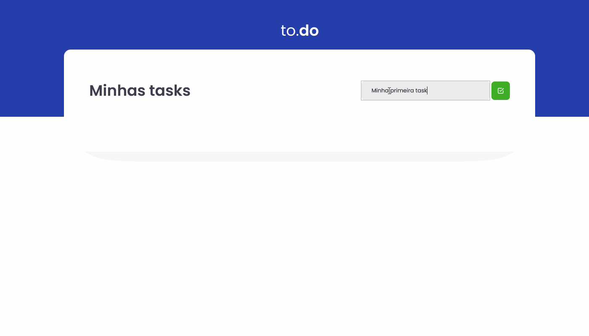

<h1 align="center">
    
</h1>

<p align="center">
  <a href="#technologies">Technologies</a>&nbsp;&nbsp;&nbsp;|&nbsp;&nbsp;&nbsp;
  <a href="#-preview">Preview</a>&nbsp;&nbsp;&nbsp;|&nbsp;&nbsp;&nbsp;
  <a href="#-layout">Getting started</a>&nbsp;&nbsp;&nbsp;|&nbsp;&nbsp;&nbsp;
  <a href="#-project">Project</a>&nbsp;&nbsp;&nbsp;|&nbsp;&nbsp;&nbsp;
  <a href="#-layout">Template</a>&nbsp;&nbsp;&nbsp;|&nbsp;&nbsp;&nbsp;
  <a href="#-license">License</a>
</p>

<p align="center">
  
  
  

  
</p>

<br>

<p align="center">
  
</p>

## 🧪 Technologies

This project was developed using the following technologies:

- [React](https://reactjs.org)
- [TypeScript](https://www.typescriptlang.org/)
- [SASS](https://sass-lang.com/)

## 🔥 Preview

[](#)

## 🚀 Getting started

Clone the project and access the folder

```bash
$ git clone https://github.com/eduardoluizdev/todo.git && cd todo
```

Follow the steps below

```bash
# Install the dependencies
$ yarn

# Start the project
$ yarn dev
```

## 💻 Project

Project developed to fix state teachings within React 💜

This is a project developed during the first Bootcamp Ignite ** Chapter, presented by ** [@Rocketseat] (https://github.com/Rocketseat) \*\*.

## 🔖 Template

You can view the project template through the links below:

- [Application Template](https://github.com/rocketseat-education/ignite-template-reactjs-conceitos-do-react)

## 📝 License

This project is licensed under the MIT License. See the [LICENSE](LICENSE.md) file for details.

---

<p align="center">Made with 💜 by [Eduardo Luiz](https://www.eduardoluiz.dev/)</p>
